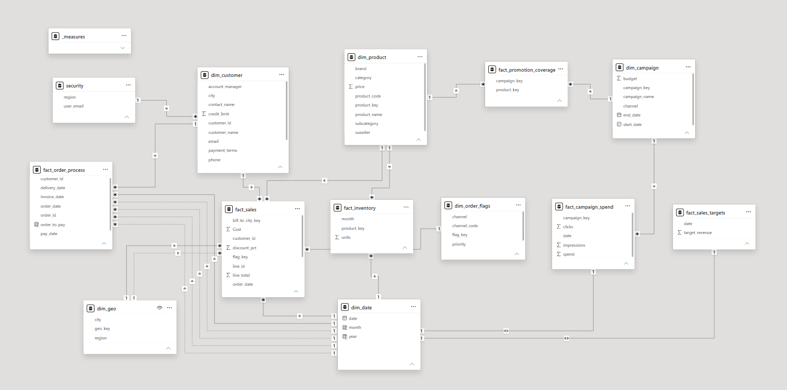

# Power BI End-to-End Data Modeling Project — "Nightmare Data Model"

## Overview
This project involved building a complete Power BI data model from a deliberately messy, real-world-style dataset spanning **sales, inventory, campaigns, customers, order flags, and sales targets**. The dataset was designed to replicate the kind of ambiguous, non-ideal data structures analysts actually encounter on the job — multiple fact tables, inconsistent grains, and relationships that don't resolve cleanly out of the box.

This project was completed by following [Baraa Khatib Salkini's](https://www.linkedin.com/in/baraa-khatib-salkini/) "Nightmare Data Model" tutorial ([YouTube](https://youtu.be/0A2k62YEbfI)), with additional debugging, analysis, and documentation done independently as part of building my personal data analytics portfolio.

## Data Model Architecture

The final model includes:
- **9 dimension/fact tables**: `dim_customer`, `dim_product`, `dim_campaign`, `dim_date`, `dim_geo`, `dim_order_flags`, `fact_sales`, `fact_inventory`, `fact_order_process`, `fact_campaign_spend`, `fact_promotion_coverage`, `fact_sales_targets`
- A dedicated `measures` table for organizing DAX measures
- A `security` table for Row-Level Security (RLS) implementation

## Key Challenges & How I Solved Them

### 1. Resolving Multiple Fact Table Relationships
The model included several fact tables (sales, inventory, campaign spend, order process, sales targets) that all needed to relate back to shared dimensions like `dim_date` and `dim_product` without creating ambiguous filter paths or circular relationships. I worked through which relationships needed to be active vs. inactive, and where `USERELATIONSHIP()` was needed in DAX to handle multiple valid date relationships within the same fact table.

### 2. Debugging a Date Granularity Mismatch
While building the monthly sales trend visual, `SUM(fact_sales[line_total])` was returning the **same total value for every month** instead of breaking down correctly — effectively ignoring the date filter entirely.

**Root cause:** `fact_sales[order_date]` was stored as a **date/time** data type, while `dim_date[date]` was a plain **date** type. Because the time component made every value technically unique down to the second, Power BI couldn't match rows to the date dimension correctly, which broke the relationship's filtering behavior.

**Fix:** Converted `order_date` to a pure date data type (stripping the time component) so it matched the grain of `dim_date[date]` exactly. This is a classic real-world Power BI gotcha — fact table timestamps and date dimensions need to match grain exactly, or relationships silently fail to filter as expected.

### 3. Implementing Row-Level Security (RLS)
Built region-based RLS using the `security` table, mapping `user_email` to `region`, so that each user only sees data relevant to their assigned region when the report is deployed to the Power BI Service. This involved:
- Creating DAX filter expressions on the `security` table
- Establishing the relationship path from `security` → `dim_customer`/`dim_geo` so the filter correctly propagates through to all fact tables
- Testing the RLS roles using "View As Role" before deployment

## Tools & Skills Used
- **Power BI Desktop** — data modeling, relationships, star schema design
- **Power Query (M)** — data cleaning and transformation
- **DAX** — measures, `USERELATIONSHIP()`, RLS filter expressions
- **Data Modeling Concepts** — star schema, fact/dimension design, grain matching, bridge tables

## Related Projects
This project builds on other work in my data analytics portfolio, including:
- A SQL data warehouse built on **Medallion Architecture** with ERP and CRM data ingestion
- A Power BI **customer churn dashboard** analyzing 7,000+ customers

## Credits
Full credit to [Baraa Khatib Salkini](https://www.linkedin.com/in/baraa-khatib-salkini/) for designing this project — it's one of the better hands-on resources for practicing real-world Power BI data modeling rather than clean, textbook scenarios.

## Connect
I'm currently exploring data analyst / data science roles and freelance opportunities.
- LinkedIn: [www.linkedin.com/in/shahbazhmirza]
- GitHub: [https://github.com/Shahbazhm/powerbi-sales-data-model-project]
